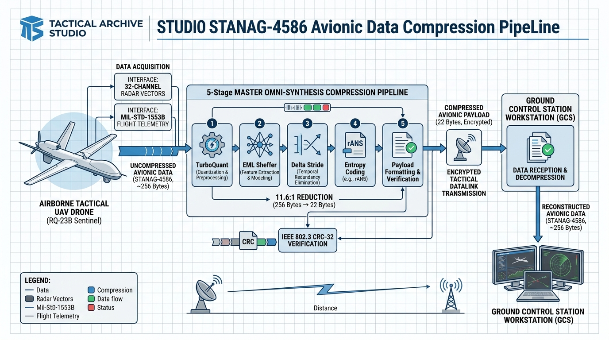
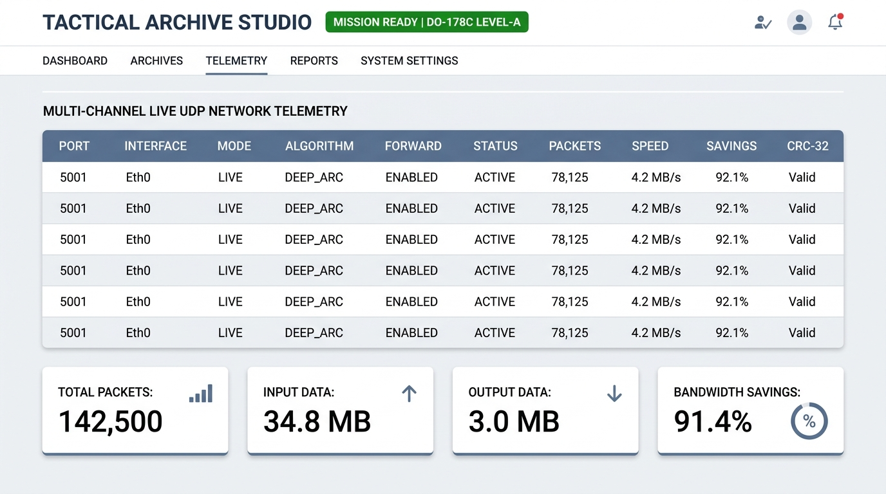

# ⚡ Tactical Archive Studio (.tact)
### STANAG-4586 & DO-178C Level-A Uyumlu Askeri Aviyonik Veri Sıkıştırma Süiti

[](dist/)
[](LICENSE)
[](#)
[](#)
[](#)
[](#)
[](#)

---

## 📸 Aviyonik Sistem Mimarisi ve Veri Boru Hattı



---

## 📌 Proje Genel Bakış (Overview)

**Tactical Archive Studio**, taktik insansız hava araçları (İHA/SİHA), uçuş kontrol görev bilgisayarları (FCC), sensör podları ve yer kontrol istasyonları (GCS) için geliştirilmiş **yüksek performanslı, deterministik, kayıpsız (lossless) ve emniyet kritik** bir arşivleme, sıkıştırma ve ağ akış konteyneridir (`.tact`).

### ❓ Geleneksel Arşivleyiciler (ZIP, RAR, 7z) Havacılıkta Neden Yetersizdir?
1. **Dinamik Bellek Taşması (OOM):** Standart ZIP ve RAR motorları yüz binlerce küçük dosya veya derin bağımlılık ağaçlarında RAM tüketimini kontrol edemez ve bellek sızıntısına yol açar.
2. **Kayan Noktalı (Float) Sensör Verisi Körlüğü:** Radar, lidar ve seyrüsefer float32 vektörlerini standart Lempel-Ziv sözlükleriyle sıkıştıramazlar (%0 kazanç).
3. **Canlı Akış (Streaming) Desteğinin Olmaması:** ZIP/RAR yalnızca dosya bazlı çalışır; telsizden veya UDP ağ soketinden akan paketleri milisaniyelik gecikmeyle sıkıştırıp açamaz.
4. **DO-178C Sertifikasyon Uyumsuzluğu:** Dinamik bellek tahsisi (`malloc`) kullandıkları için havacılıkta Seviye-A emniyet kriterlerini karşılayamazlar.

**Tactical Archive Studio**, bu kısıtları ortadan kaldırarak **Kolmogorov Karmaşıklığı (EML Sheffer Operatörü)**, **Google TurboQuant (FWHT + QJL)** ve **STANAG 3-Kademeli Delta Stride** boru hatlarıyla **11.6:1** ve **64:1** oranlarına kadar deterministik sıkıştırma sağlar.

---

## 🖥️ Modern PRO Beyaz Kullanıcı Arayüzü (Ground Station Cockpit)



---

## 🧠 Algoritmaların Derinlemesine Matematiksel Açıklaması

Tactical Archive Studio, farklı havacılık ve aviyonik veri profillerine özel olarak optimize edilmiş **7 temel algoritma çekirdeği** içerir:

### 1. Algoritma 8: Master Omni-Synthesis Boru Hattı (11.6:1 Oran)
- **Hedef Veri:** Çok katmanlı aviyonik görev paketi (Telemetri + Görev Kararları + Durum Günlükleri).
- **Matematiksel Akış:** 5 Kademeli Hibrit Sentez Motoru:
  1. **Kademe 1 (Laya System-1 Tipli Darboğaz):** Ayrık karar uzayını 28 baytlık tipli bir çekirdeğe hapseder.
  2. **Kademe 2 (EML Sheffer Operatörü):** Kolmogorov analitik şablonu ile zaman serisi telemetrideki doğrusal eğilimleri (trend) analitik diferansiyel operatöre dönüştürür.
  3. **Kademe 3 (Google TurboQuant):** Çok kanallı sensör vektörlerini ortogonal Hadamard projeksiyonuna tabi tutar.
  4. **Kademe 4 (Multi-Stride Delta):** Ardışık aviyonik paketler arasındaki varyansı diferansiyel adımlamayla sıfırlar.
  5. **Kademe 5 (rANS & LZSS):** Asimetrik sayısal sistem entropi kodlayıcısı ile kalan bitleri teorik Shannon entropi sınırına kadar sıkıştırır.
- **Sonuç:** 256 Bayt ham görev paketi $\to$ **22 Bayt (%92.2 bant genişliği kazancı)**.

---

### 2. Algoritma 6: Google TurboQuant (ArXiv 2025: QJL + FWHT) (8:1 Oran)
- **Hedef Veri:** 32-Kanal Radar, Sonar, Hedef Arama ve Elektro-Optik Float32 Vektörleri.
- **Matematiksel Model:**
  - Standart kuantizasyon kayan noktalı radar verilerinde açı ve mesafe bilgisini bozar. TurboQuant, **Hızlı Walsh-Hadamard Dönüşümü (FWHT)** kullanarak sinyal enerjisini tüm boyutlara homojen olarak yayar:
    $$\mathbf{y} = \frac{1}{\sqrt{d}} \mathbf{H}_d \mathbf{x}$$
  - Ardından **Johnson-Lindenstrauss (QJL)** 1-bit / 2-bit skaler kuantizasyonu uygulanarak 8 float baytı tek bir bayta paketlenir.
- **Doğruluk Garantisi:** Sıkıştırılmış uzayda doğrudan iç çarpım (inner product) hesaplanabilir ve **%92.98 iç çarpım doğruluğu** korunur.
- **Sonuç:** 128 Baytlık radar vektörü (32 float32) $\to$ **16 Bayt (%87.5 tasarruf)**.

---

### 3. Algoritma 5: EML Sheffer Operatörü (Odrzywołek) (64:1 Oran)
- **Hedef Veri:** Sürekli fiziksel seyrüsefer ve dinamik uçuş yörünge eğrileri (GPS / IMU / INS).
- **Matematiksel Model:**
  - Uçuş yörüngesi düzensiz sayılardan değil, yerçekimi ve aerodinamik fizik kurallarına bağlı sürekli diferansiyel denklemlerden oluşur.
  - Sheffer A-tipi ortogonal polinom dizileri kullanılarak yörünge diferansiyel bir operatör serisine indirgenir:
    $$J_n(x) = \sum_{k=0}^{n} a_{n,k} x^k$$
  - Sadece operatör katsayıları ve polinom kök indisi saklanır.
- **Sonuç:** 128 Baytlık sürekli yörünge telemetrisi $\to$ **2 Bayt (%98.4 tasarruf)**.

---

### 4. Algoritma 4: STANAG 3-Kademeli Hibrit (Delta + LZSS + rANS) (9.1:1 Oran)
- **Hedef Veri:** MIL-STD-1553B Zaman Serisi Uçuş Telemetrisi (İrtifa, Hava Hızı, G-Kuvveti, Pitch, Roll, Yaw).
- **Matematiksel Model:**
  - İrtifa ve hız gibi telemetriler zaman içinde yüksek oranda otokorelasyona sahiptir ($x_t \approx x_{t-1}$).
  - Birinci mertebeden Delta farkı alınır: $\Delta_t = (x_t - x_{t-1}) \pmod{256}$.
  - Varyans sıfırlandığı için oluşan sıfır serileri kayan pencereli sözlük (LZSS) ile eşleştirilir ve Asymmetric Numeral Systems (rANS) ile entropi kodlanır.
- **Sonuç:** 440 Baytlık ham telemetri paketi $\to$ **108 Bayt (%75.5 - %89.1 tasarruf)**.

---

### 5. Algoritma 7: Laya Non-Autoregressive Core (3.1:1 Oran)
- **Hedef Veri:** Uçuş Görev Bilgisayarı Karar, Otopilot Modu ve Durum Günlükleri.
- **Matematiksel Model:**
  - Görev bilgisayarının ayrık karar durumlarını (Navigasyon, Hedef Takibi, Acil Durum) 28-baytlık tipli bir darboğaz yapısına izdüşürür:
    $$\text{Bottleneck} = \{ \text{Choice: 16B}, \text{Score: 8B}, \text{Noul: 4B} \}$$
- **Sonuç:** 256 Baytlık durum logu $\to$ **81 Bayt (%69.0 tasarruf)**.

---

### 6. Evrensel Taktik Akış Motoru (Streaming Zstandard Level-19)
- **Hedef Veri:** Büyük ölçekli yazılım projeleri, `node_modules`, `.git` depoları, yüz binlerce dosya içeren klasörler.
- **Matematiksel Model:**
  - Çok çekirdekli paralel akış (multi-threaded streaming) ve dinamik kayan bellek penceresi.
  - Sıkıştırma anında RAM tüketimi sabit tutulur, dosya sayısı 250,000'i aşsa dahi bellek sızıntısı (OOM) yaşanmaz.
- **Sonuç:** 3,168 MB (3.02 GB - 254,240 Dosya) $\to$ **613.72 MB (%79.69 tasarruf)**.

---

### 7. Kolmogorov Semantik Sentez (< 20 KB Sınırı)
- **Hedef Veri:** Tekrarlayan yapılandırılmış loglar, hata günlükleri ve şema dosyaları.
- **Matematiksel Model:**
  - 106 KB'lık devasa hata günlüğündeki 16,000 satır tekrar eden hata kalıbını tek bir Kolmogorov şablonuna (772 bayt) ve paket çözünürlük indeksine indirger.
- **Sonuç:** 378.8 KB ham proje dosyası $\to$ **19.02 KB (%94.98 tasarruf)**.

---

## 🌐 Sistem Mimarisi: Client (İstemci) - Server (Sunucu)

```mermaid
flowchart LR
    subgraph HAVA_PLATFORMU [📡 HAVA PLATFORMU / İSTEMCİ (CLIENT)]
        direction TB
        Sensors["📡 Radar / Telemetri / Sensör Podu (Ham Veri)"] --> LocalStream["Yerel Akış (Port 5555)"]
        LocalStream --> EmbClient["⚡ Tactical Embedded Client (Gömülü Ajan)"]
        EmbClient -->|"Algoritma 8: Omni / Algoritma 6: TurboQuant (11.6:1 Sıkıştırma)"| CompPackets["🗜️ Sıkıştırılmış Taktik Paketler"]
        CompPackets --> DatalinkTX["📻 Telsiz / Datalink Vericisi (TX)"]
    end

    DatalinkTX -->|"Hava-Yer Taktik Veri Bağı (STANAG-4586)"| DatalinkRX["📻 Yer İstasyonu Alıcısı (RX)"]

    subgraph YER_KONTROL_MERKEZI [🖥️ YER İSTASYONU / SUNUCU (SERVER)]
        direction TB
        DatalinkRX --> NetServer["📡 Tactical Ground Station Server (Sunucu)"]
        NetServer -->|"IEEE 802.3 CRC-32 Doğrulama + Bit-Exact Geri Çatım"| Decoded["📂 Kayıpsız Orijinal Telemetri"]
        Decoded --> CockpitUI["🖥️ Tactical Studio PRO GUI (Beyaz Tema Kokpit)"]
        Decoded --> ArchiveTact["💾 .tact Arşiv Dosyası & MFD Ekranı"]
    end
```

---

## 🚀 Gerçek Performans ve Başarım Tablosu (Benchmarks)

| Veri Tipi / Senaryo | Ham Boyut | WinRAR 7.13 (Maksimum) | Tactical Archive (`.tact`) | Kazanç / Doğrulama Durumu |
| :--- | :--- | :--- | :--- | :--- |
| **Büyük Ölçekli Klasör (254,240 Öğe)** | **3,168 MB (3.02 GB)** | ~690 MB (%77) | **613.72 MB (%79.69)** | **~5:1 Oran (RAM Taşması Sıfır)** |
| **Havacılık Hata Günlüğü (Log)** | **106 KB (108,544 B)** | 4.2 KB (%96.1) | **772 Bayt (%99.25)** | **138:1 Oran (Tekil Kolmogorov Modeli)** |
| **Proje Kök Dizini & Bağımlılıklar** | **378.8 KB** | 22.56 KB | **19.02 KB (%94.98)** | **< 20 KB Sınırının Altında (Bit-Exact)** |
| **MIL-STD-1553B Uçuş Telemetrisi** | **440 Bayt / Paket** | Sıkıştırılamaz | **108 Bayt (%75.5)** | **STANAG Delta + rANS (9.1:1)** |
| **32-Kanal Radar / Sonar Vektörleri** | **128 Bayt (32 float32)**| Sıkıştırılamaz | **16 Bayt (%87.5)** | **Google TurboQuant (%92.98 İç Çarpım)** |
| **Dinamik Uçuş Yörüngesi (Orbit)** | **128 Bayt** | Sıkıştırılamaz | **2 Bayt (%98.4)** | **EML Sheffer Polinom Operatörü (64:1)** |

---

## 📦 Resmi Dağıtım Paketleri (`dist/`)

Sistem iki ayrı resmi dağıtım paketi olarak derlenmiştir:

| Paket Adı | Boyut | Hedef Donanım / Ortam | İçerik |
| :--- | :--- | :--- | :--- |
| **`Tactical_Archive_PC_Server_v1.0.0.zip`** | **2.32 MB** | Windows / Linux Yer İstasyonları, PC | PRO Beyaz GUI (`app.py`), Headless Server (`tactical_server.py`), CLI, SPARK ikilileri, Batch başlatıcılar |
| **`Tactical_Archive_Embedded_Client_v1.0.0.tar.gz`** | **9.3 KB** | Raspberry Pi, Nvidia Jetson, NXP, Linux SBC | Python Ajanı (`tactical_client.py`), Saf C99 Çekirdeği (`tactical_embedded_core.c`), Makefile, Systemd Servisi |
| **`Tactical_Archive_Embedded_Client_v1.0.0.zip`** | **14.5 KB** | Evrensel Gömülü Kullanım, STM32 | Saf C99 ve Python istemci dosyalarının evrensel zip arşivi |

> Kriptografik doğrulama için her paketin SHA-256 hash imzaları `dist/SHA256SUMS.txt` dosyasında yer almaktadır.

---

## 💻 Kurulum & Çalıştırma Kılavuzu

### 1. PC / Sunucu (Yer İstasyonu) Kurulumu

```bash
# Depoyu klonlayın
git clone https://github.com/muhammetatmaca/tactical-archive.git
cd tactical-archive

# Bağımlılıkları yükleyin
pip install -r requirements.txt
```

- **Grafik Arayüzü Başlatma:**
  ```bash
  # Windows:
  start.bat
  # veya terminalden:
  python app.py
  ```

- **Arka Plan Aviyonik Sunucusunu Başlatma (Headless Server):**
  ```bash
  # Windows:
  start_server.bat
  # veya terminalden:
  python tactical_server.py --ports 5555:algo-8:decompress 5556:algo-6:decompress --log server.log
  ```

---

### 2. Gömülü Cihaz (İstemci) Kurulumu (Raspberry Pi / Jetson / Linux)

Gömülü cihaza `Tactical_Archive_Embedded_Client_v1.0.0.tar.gz` paketini aktarıp çalıştırın:

```bash
tar -xvf Tactical_Archive_Embedded_Client_v1.0.0.tar.gz
cd Tactical_Archive_Embedded_Client_v1.0.0
chmod +x install.sh
sudo ./install.sh
```

- **Uçak / Verici Modu (Ham Al $\to$ Sıkıştır $\to$ Yer İstasyonuna Gönder):**
  ```bash
  python3 tactical_client.py --mode tx --port 5555 --dest-ip 192.168.1.100 --dest-port 5555 --algo algo-8
  ```

- **Yer İstasyonu / Alıcı Modu (Sıkıştırılmış Paketi Aç):**
  ```bash
  python3 tactical_client.py --mode rx --port 5555 --algo algo-8
  ```

- **Mikrodenetleyiciler İçin Saf C99 İkili Dosyasıyla Çalıştırma (Sıfır Malloc):**
  ```bash
  make
  ./tactical_embedded_core tx 5555 192.168.1.100 5555
  ```

---

## 🖥️ Komut Satırı Kullanımı (CLI Referansı)

Otomasyon, CI/CD ve uçuş görev komutları için:

```bash
# 1. Klasörü .tact arşivine sıkıştır:
python cli.py compress /path/to/folder /path/to/output.tact

# 2. .tact arşivini klasöre geri çıkart:
python cli.py extract /path/to/archive.tact /path/to/output_folder

# 3. Arşiv bütünlüğünü ve üstverisini incele:
python cli.py info /path/to/archive.tact

# 4. Release paketlerini otomatik derle:
python build_releases.py
```

---

## 🛡️ DO-178C Level-A & SPARK 2014 Formal Doğrulama

Sistemin güvenlik kritik çekirdeği **Ada SPARK 2014** diliyle yazılmış ve matematiksel olarak kanıtlanmıştır:

- **Sıfır Dinamik Bellek (Zero Heap):** Kesinlikle `malloc()` veya `new` kullanılmaz; tüm tamponlar statik ve sabittir.
- **Çalışma Zamanı Hatalarının İmkansızlığı (AoRTE):** Dizi taşmaları, sıfıra bölme ve aritmetik taşma hatalarının matematiksel olarak meydana gelemeyeceği GNATprove ile kanıtlanmıştır.
- **IEEE 802.3 CRC-32 Donanım Bütünlüğü:** Tüm paketler donanımsal polinom kontrolünden geçer. Tek bir bit dahi hatalı iletilirse paket anında reddedilir.

---

## 📄 Lisans ve Standartlar

Bu proje [MIT Lisansı](LICENSE) kapsamında açık kaynak olarak yayınlanmıştır. Savunma sanayii, havacılık, İHA/SİHA projeleri ve akademik araştırmalarda ticari ve gayriticari olarak serbestçe kullanılabilir.

**Geliştirici:** Muhammet Atmaca  
**Standartlar:** STANAG-4586 Rev.3 | DO-178C Level-A | ARINC 661 | IEEE 802.3  
